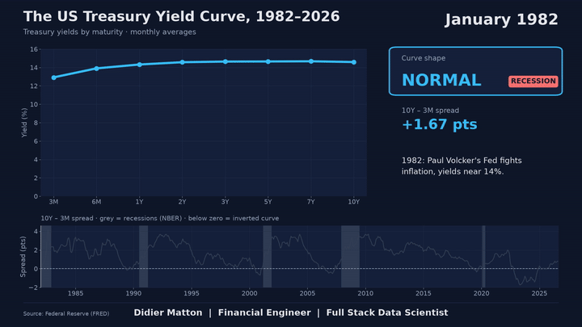

# US Treasury Yield Curve, 1982 to today

**44 years of the US yield curve in 60 seconds, and the recession signal hidden in its shape.**

▶ **Full video on YouTube:** [watch here](https://youtu.be/eS9TWiMxKdM)

## What the animation shows

Each frame shows the US Treasury yield curve for one month, from 3 months to 10 years:

- 🔵 **Blue**: normal curve (long-term yields above short-term yields)
- 🟡 **Yellow**: flat curve (10Y – 3M spread below 0.5 point)
- 🔴 **Red**: inverted curve (short-term yields above long-term yields)

The timeline below tracks the 10Y – 3M spread month by month, with official US recessions (NBER) shaded in grey. A short comment explains each phase: Volcker's fight against inflation, the 2000 and 2006–2007 inversions, the zero-rate era after 2008, Covid, and the fastest Fed hiking cycle in 40 years.

## Key findings

| Recession (NBER) | First month of inversion* | Recession start | Lead time |
|------------------|---------------------------|-----------------|-----------|
| 1990–1991 | June 1989 | July 1990 | 13 months |
| 2001 | July 2000 | March 2001 | 8 months |
| 2007–2009 | August 2006 | December 2007 | 16 months |
| 2020 | 2019 | February 2020 | less than 12 months |

\*First month with a negative 10Y – 3M spread (monthly averages) before each recession.

- **The inversion led the three "classic" recessions by 8 to 16 months.** Markets had priced the slowdown well before it showed up in the economy.
- **2020 is a special case:** the curve did invert in 2019, but the recession was triggered by the Covid shock, so the signal should not get full credit for it.
- **The inversion from late 2022 to late 2024 was the deepest since the early 1980s**, yet no recession had been declared by the NBER at the time of writing. A useful reminder that the curve is a warning sign, not a forecast.

## Why the 10Y – 3M spread

The video uses the 10-year minus 3-month spread, the measure behind the New York Fed's recession probability model. The 3-month yield closely tracks the Fed's policy rate, so every hiking or cutting cycle shows up directly on the spread. The 10Y – 2Y spread, widely quoted by markets, tells a very similar story.

## Data and method

| Item | Detail |
|------|--------|
| Source | FRED, Federal Reserve Bank of St. Louis |
| Series | Constant maturity Treasury yields: `DGS3MO`, `DGS6MO`, `DGS1`, `DGS2`, `DGS3`, `DGS5`, `DGS7`, `DGS10` |
| Frequency | Daily data converted to monthly averages; the current, incomplete month is excluded |
| Period | January 1982 to the last complete month |
| Recessions | NBER business cycle dates (peak to trough) |
| Comments | Hand-written for each phase up to the end of 2024, then generated from the data (moves in short and long rates, curve shape) |

The 1-month bill (available only since 2001) and the 30-year bond (not issued between 2002 and 2006) are left out to keep the curve consistent over time.

## Output formats

| File | Size | Platforms |
|------|------|-----------|
| `yield_curve_en_YouTube-X_16x9.mp4` | 1920 × 1080 | YouTube, X |
| `yield_curve_en_LinkedIn_4x5.mp4` | 1080 × 1350 | LinkedIn |
| `yield_curve_en_TikTok-Shorts-Reels_9x16.mp4` | 1080 × 1920 | TikTok, YouTube Shorts, Instagram Reels |

## Run it yourself

1. Install the dependencies from the repository root: `pip install -r requirements.txt`
2. Copy `.env.example` to `.env` in this folder and add your free FRED API key.
3. Run the script from this folder: `python yield_curve_video.py`

The videos are saved in a `videos/` folder. Settings (languages, formats, background music) are at the top of the script.

## Limitations

- Monthly averages smooth out short, sharp moves visible in daily data.
- Lead times depend on the spread and the frequency used; daily data or the 10Y – 2Y spread give slightly different dates.
- The yield curve is a leading indicator, not a forecast: not every inversion is followed by a recession.

## Author

**Didier Matton** | Financial Engineer | Full Stack Data Scientist

[LinkedIn](https://lnkd.in/p/d46qrF7M) · [YouTube](https://youtu.be/eS9TWiMxKdM)