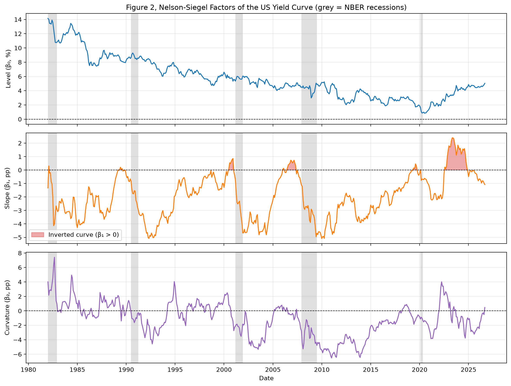
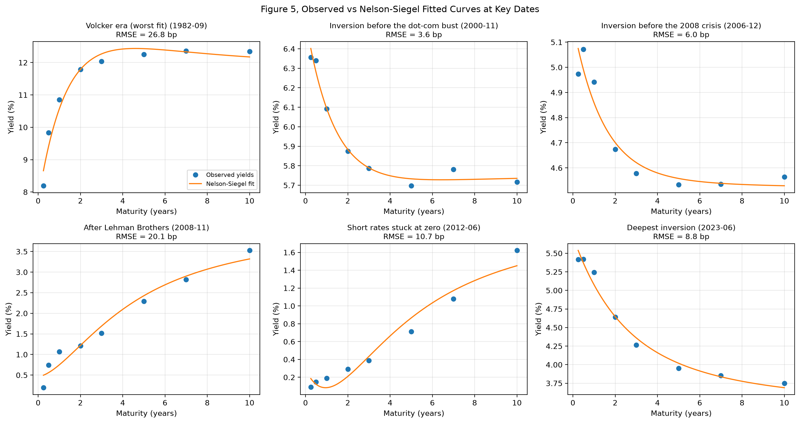

# Facteurs de Nelson-Siegel de la courbe des taux américaine, 1982–2026

🇬🇧 [English version](README.md)

**Trois chiffres pour décrire 44 ans de courbe des taux américaine : le niveau, la pente et la courbure.**

## Ce que fait ce projet

Le notebook ajuste le modèle de Nelson-Siegel sur la courbe des taux du Trésor américain **chaque mois, de janvier 1982 à septembre 2026 (537 mois)**. Il suit les trois facteurs dans le temps, vérifie qu'ils ont bien leur sens économique, et montre où le modèle s'ajuste bien et où il peine.

## Résultats clés

| # | Résultat | Preuve |
|---|----------|--------|
| 1 | **Trois facteurs décrivent 44 ans de courbe des taux américaine** | Erreur médiane de 4,4 pb (0,044 %) sur 537 mois ; 75 % des mois sous 6,4 pb (0,064 %) |
| 2 | **Les facteurs veulent bien dire ce qu'ils annoncent** | Corrélation avec les mesures observées : niveau 0,988, pente 0,992, courbure 0,998 |
| 3 | **Les inversions sont rares** | La courbe n'est inversée (β₁ > 0) que dans 11,5 % des mois, environ un mois sur neuf |
| 4 | **Les inversions ont précédé les récessions** | Pente inversée en 2000, en 2006–2007 et en 2019, avant les récessions de 2001, 2008 et 2020 ; l'inversion la plus forte (2022–2024) n'a pas été suivie d'une récession |
| 5 | **Quatre décennies de baisse des taux, puis un rebond** | Le niveau est passé de 14,14 % (1982) à 0,84 % (2020), puis est remonté à 5,03 % en septembre 2026 |
| 6 | **Le point faible du modèle, c'est la partie courte** | Les formes « propres » sont très bien ajustées (3,6 pb en novembre 2000), mais pas les coudes soudains entre 3 mois et 1 an : 26,8 pb en septembre 1982, 20,1 pb en novembre 2008, 10,7 pb en juin 2012 |

## Méthode

| Élément | Détail |
|---------|--------|
| Données | FRED : `DGS3MO`, `DGS6MO`, `DGS1`, `DGS2`, `DGS3`, `DGS5`, `DGS7`, `DGS10`, converties en moyennes mensuelles |
| Modèle | Nelson-Siegel avec un taux de décroissance fixé, λ = 0,7308 par an (Diebold et Li, 2006) |
| Estimation | Une régression par moindres carrés chaque mois (`nelson_siegel_svensson`) |
| Qualité de l'ajustement | Erreur quadratique moyenne (RMSE), en points de base |
| Validation | Facteurs comparés au taux à 10 ans, à l'écart 10 ans − 3 mois et au papillon (2 × 2 ans − 3 mois − 10 ans) |
| Récessions | Dates officielles du NBER |

**Pourquoi un λ fixe ?** Estimer λ chaque mois rend les facteurs instables et difficiles à comparer dans le temps, et l'optimisation peut échouer. Avec λ fixé, chaque ajustement devient une simple régression linéaire, et les trois facteurs restent comparables sur 44 ans.

## Reproduire le projet

1. À la racine du dépôt : `pip install -r requirements.txt`
2. Place ta clé API FRED (gratuite) dans un fichier `.env` à la racine du dépôt : `FRED_API_KEY=ta_cle`
3. Ouvre `nelson_siegel_factors.ipynb` et exécute toutes les cellules.

## Limites

- Avec un λ fixe, le modèle ne peut pas suivre les coudes soudains à court terme, ni le plancher à zéro.
- Les fortes corrélations avec les mesures observées sont en partie mécaniques : les deux sont des combinaisons linéaires des mêmes taux.
- La courbe des taux est un indicateur avancé, pas une prévision : toutes les inversions ne sont pas suivies d'une récession.

## References

  - Diebold, F. X. & Li, C. (2006). *Forecasting the Term Structure of Government Bond Yields*. Journal of Econometrics, 130(2), 337–364. [Free working paper (NBER)](https://www.nber.org/papers/w10048)

## Projet lié

[01 · Animation de la courbe des taux américaine](../01-us-yield-curve-animation/) : la même courbe, animée mois par mois.

## Auteur

**Didier Matton** | Ingénieur financier | Data Scientist Full Stack