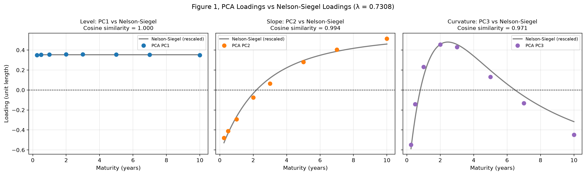
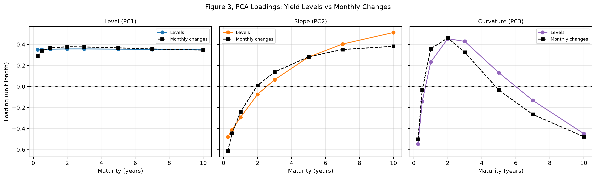

# ACP de la courbe des taux américaine face à Nelson-Siegel, 1982–2026

🇬🇧 [English version](README.md)

**Sans rien savoir de la finance, une ACP retrouve les trois mêmes forces que la formule de Nelson-Siegel : le niveau, la pente et la courbure.**

## Ce que fait ce projet

Le notebook réalise une analyse en composantes principales sur huit taux du Trésor américain, sur **537 mois (de janvier 1982 à septembre 2026)**. Il compare les composantes principales aux facteurs de Nelson-Siegel estimés dans le [projet 02](../02-nelson-siegel-yield-curve-factors/README.fr.md), par leur forme et dans le temps, puis refait l'analyse sur les variations mensuelles des taux, l'approche standard en gestion des risques.

## Résultats clés

| # | Résultat | Preuve |
|---|----------|--------|
| 1 | **Les données retrouvent seules les formes de Nelson-Siegel** | Similarité cosinus entre les loadings de l'ACP et ceux de Nelson-Siegel : niveau 1,000, pente 0,994, courbure 0,971 ; la bosse de PC3 culmine vers 2 ans et demi, exactement là où culmine la courbure de Nelson-Siegel avec λ = 0,7308 |
| 2 | **Trois facteurs expliquent presque tout** | 99,98 % de la variance des niveaux de taux et 99,05 % des variations mensuelles |
| 3 | **Les niveaux surestiment le facteur de niveau** | PC1 explique 97,68 % des niveaux mais 84,41 % des variations mensuelles ; la pente et la courbure représentent environ 15 % des mouvements mensuels, si bien qu'une couverture par la seule duration laisse environ 15 % des mouvements mensuels de la courbe sans couverture |
| 4 | **La pente est le facteur le plus robuste** | PC2 et −β₁ sont corrélés à 0,993 sur 44 ans |
| 5 | **Deux notions différentes du « niveau »** | PC1 (niveau moyen) et β₀ (niveau de très long terme) sont corrélés à 0,933 ; leurs écarts en 2009–2015 et en 2022–2025 reflètent la pente |
| 6 | **La courbure est le facteur fragile** | PC3 n'explique que 0,12 % des niveaux et sa corrélation avec β₂ est de 0,656 ; son loading descend plus vite à long terme que celui de Nelson-Siegel, la limite qui a conduit Svensson à ajouter une seconde bosse |
| 7 | **La partie courte vit sa propre vie** | Sur les variations mensuelles, le taux à 3 mois a le plus faible loading de niveau (0,29) et le plus fort loading de pente (−0,61) |

## Méthode

| Élément | Détail |
|---------|--------|
| Données | FRED : `DGS3MO`, `DGS6MO`, `DGS1`, `DGS2`, `DGS3`, `DGS5`, `DGS7`, `DGS10`, en moyennes mensuelles |
| ACP | Taux standardisés, décomposition de la matrice de covariance avec `numpy.linalg.eigh` (conçue pour les matrices symétriques) |
| Convention de signe | PC1 monte quand tous les taux montent, PC2 quand la courbe se pentifie, PC3 quand une bosse apparaît au milieu |
| Comparaison des formes | Loadings de Nelson-Siegel ramenés à une longueur de 1 (pente et courbure centrées), comparés par similarité cosinus |
| Comparaison dans le temps | Corrélation entre chaque composante et son facteur de Nelson-Siegel (PC2 avec −β₁) |
| Variations | Même ACP sur les variations des taux d'un mois à l'autre |

## Reproduire le projet

1. À la racine du dépôt : `pip install -r requirements.txt`
2. Place ta clé API FRED (gratuite) dans un fichier `.env` à la racine du dépôt : `FRED_API_KEY=ta_cle`
3. Ouvre `pca_yield_curve_factors.ipynb` et exécute toutes les cellules.

## Limites

- L'analyse est descriptive et réalisée sur l'échantillon complet : elle ne teste pas si les facteurs aident à prévoir les taux. Le [projet 04](../04-yield-curve-forecasting/) traite cette question.
- Les moyennes mensuelles lissent la volatilité et créent une autocorrélation artificielle dans les variations mensuelles ; les valeurs de fin de mois seraient préférables pour l'ACP sur les variations.
- Les taux à maturité constante de FRED sont des rendements d'obligations à coupon, alors que Nelson-Siegel modélise en principe la courbe zéro-coupon.
- Les taux sont standardisés, ce qui donne le même poids à chaque maturité ; une ACP sur la covariance brute des variations (en points de base) pondérerait les maturités selon leur volatilité réelle.
- Seules les maturités jusqu'à 10 ans sont utilisées : la partie longue évoquée par Svensson n'est donc pas observée directement.

## Références

- Diebold, F. X. et Li, C. (2006). *Forecasting the Term Structure of Government Bond Yields*. Journal of Econometrics, 130(2), 337–364. [Version de travail gratuite (NBER)](https://www.nber.org/papers/w10048)
- Litterman, R. et Scheinkman, J. (1991). *Common Factors Affecting Bond Returns*. Journal of Fixed Income, 1(1), 54–61.
- Nelson, C. R. et Siegel, A. F. (1987). *Parsimonious Modeling of Yield Curves*. Journal of Business, 60(4), 473–489.

## Projets liés

- [01 · Animation de la courbe des taux américaine](../01-us-yield-curve-animation/)
- [02 · Facteurs de Nelson-Siegel de la courbe des taux américaine](../02-nelson-siegel-yield-curve-factors/README.fr.md)

## Auteur

**Didier Matton** | Ingénieur financier | Data Scientist Full Stack | Python, Django, VBA, BI & LLMs | Finance quantitative

