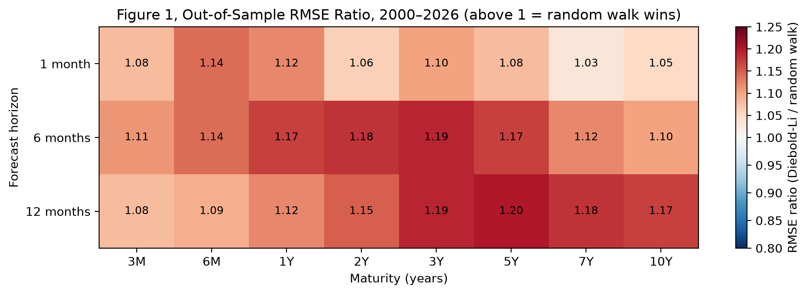
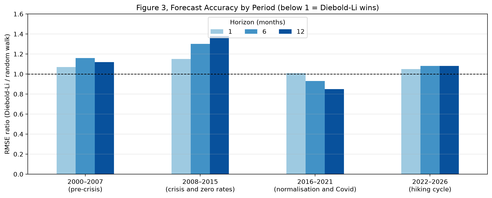
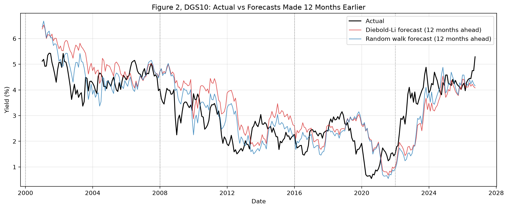

# Prévoir la courbe des taux américaine : Diebold-Li face à la prévision naïve, 1982–2026

🇬🇧 [English version](README.md)

**Les trois facteurs de Nelson-Siegel prévoient-ils la courbe des taux mieux que l'hypothèse « les taux ne bougent pas » ? Sur 2000–2026, la réponse est non, et ce projet montre pourquoi.**

## Ce que fait ce projet

Le notebook applique la méthode de Diebold et Li (2006) : la courbe des taux américaine est résumée chaque mois par les trois facteurs de Nelson-Siegel (niveau, pente, courbure), chaque facteur est prévu par un modèle AR(1), et la courbe prévue est reconstruite à 1, 6 et 12 mois. Les prévisions sont évaluées **hors échantillon de 2000 à 2026**, face à la prévision naïve (« les taux ne bougent pas »), avec un test de Diebold-Mariano, une analyse par période et un test de robustesse en fenêtre glissante.

## Résultats clés

| # | Résultat | Preuve |
|---|----------|--------|
| 1 | **La prévision naïve bat Diebold-Li hors échantillon** | Ratio des RMSE supérieur à 1 pour les 24 couples horizon-maturité sur 2000–2026, de 1,03 à 1,20 |
| 2 | **L'écart est statistiquement significatif** | Statistique de Diebold-Mariano positive dans les 24 cas et significative à 5 % dans 18 ; Diebold-Li n'est jamais significativement meilleur |
| 3 | **Prévoir à un an est difficile pour tout le monde** | RMSE d'environ 25 pb à 1 mois, mais de 80 à 160 pb à 12 mois pour les deux méthodes |
| 4 | **La faiblesse du modèle : le retour à la moyenne dans les régimes de tendance** | Erreur moyenne à 12 mois : +68 pb en 2000–2007 et +114 pb en 2008–2015 (prévisions trop hautes quand les taux baissaient ou restaient à zéro), −121 pb en 2022–2026 (prévisions trop basses pendant le cycle de hausses) |
| 5 | **Il gagne quand les taux reviennent vers leur moyenne** | 2016–2021 est le seul régime où Diebold-Li bat la prévision naïve : ratio de 0,93 à 6 mois et de 0,85 à 12 mois |
| 6 | **Aucun modèle simple n'anticipe les retournements** | Les deux prévisions suivent le taux à 10 ans avec un an de retard et manquent 2008, 2020 et 2022 |
| 7 | **Le problème est le retour à la moyenne lui-même, pas le choix de la moyenne** | Une fenêtre glissante de 10 ans fait pire que la fenêtre croissante (ratios jusqu'à 1,30, 24 tests de Diebold-Mariano sur 24 significatifs à 5 %) |

**À retenir :** le succès en prévision obtenu par Diebold et Li sur des données s'arrêtant en 2000 ne tient pas sur 2000–2026. Le problème n'est pas *vers quelle* moyenne le modèle revient, mais le retour à la moyenne lui-même : plus le modèle ramène les taux vers une moyenne historique, plus il se trompe. La prévision naïve revient à supposer aucun retour à la moyenne ; sur 2000–2026, les taux se sont comportés presque comme une marche aléatoire, et c'est pour ça qu'elle gagne.

## Méthode

| Élément | Détail |
|---------|--------|
| Données | FRED : `DGS3MO`, `DGS6MO`, `DGS1`, `DGS2`, `DGS3`, `DGS5`, `DGS7`, `DGS10`, valeurs de **fin de mois**, de janvier 1982 à septembre 2026 |
| Facteurs | Nelson-Siegel ajusté chaque mois avec un λ fixé à 0,7308 par an |
| Modèle | AR(1) direct à h pas pour chaque facteur, comme Diebold et Li (2006) : facteur(t+h) = c + φ × facteur(t) |
| Référence | Prévision naïve : les taux dans h mois sont égaux à ceux d'aujourd'hui |
| Protocole hors échantillon | Fenêtre croissante : chaque mois à partir de décembre 1999, le modèle est réestimé avec les seules données passées, puis la courbe est prévue à 1, 6 et 12 mois |
| Évaluation | RMSE en points de base, ratio des RMSE, test de Diebold-Mariano avec variance de Newey-West et correction de Harvey, Leybourne et Newbold |
| Robustesse | Le même test avec une fenêtre glissante de 10 ans |

## Reproduire le projet

1. À la racine du dépôt : `pip install -r requirements.txt`
2. Place ta clé API FRED (gratuite) dans un fichier `.env` à la racine du dépôt : `FRED_API_KEY=ta_cle`
3. Ouvre `yield_curve_forecasting.ipynb` et exécute toutes les cellules.

## Limites

- Une seule famille de modèles est testée (un AR(1) sur chaque facteur). Un VAR, un modèle avec des variables macroéconomiques ou un modèle à changement de régime pourraient se comporter autrement.
- Le test porte sur 24 couples horizon-maturité : avec de nombreux tests, quelques-uns pourraient être significatifs par hasard, même si les 24 statistiques vont toutes dans le même sens.
- Les taux à maturité constante de FRED sont des rendements d'obligations à coupon, alors que Nelson-Siegel modélise en principe la courbe zéro-coupon.
- L'évaluation porte sur des prévisions ponctuelles, pas sur des intervalles de prévision.

## Références

- Diebold, F. X. et Li, C. (2006). *Forecasting the Term Structure of Government Bond Yields*. Journal of Econometrics, 130(2), 337–364. [Version de travail gratuite (NBER)](https://www.nber.org/papers/w10048)
- Diebold, F. X. et Mariano, R. S. (1995). *Comparing Predictive Accuracy*. Journal of Business & Economic Statistics, 13(3), 253–263.
- Harvey, D., Leybourne, S. et Newbold, P. (1997). *Testing the Equality of Prediction Mean Squared Errors*. International Journal of Forecasting, 13(2), 281–291.
- Newey, W. K. et West, K. D. (1987). *A Simple, Positive Semi-Definite, Heteroskedasticity and Autocorrelation Consistent Covariance Matrix*. Econometrica, 55(3), 703–708.

## Projets liés

- [01 · Animation de la courbe des taux américaine](../01-us-yield-curve-animation/)
- [02 · Facteurs de Nelson-Siegel de la courbe des taux américaine](../02-nelson-siegel-yield-curve-factors/README.fr.md)
- [03 · ACP de la courbe des taux américaine face à Nelson-Siegel](../03-pca-yield-curve-factors/README.fr.md)

## Auteur

**Didier Matton** | Ingénieur financier | Data Scientist Full Stack | Python, Django, VBA, BI & LLMs | Finance quantitative