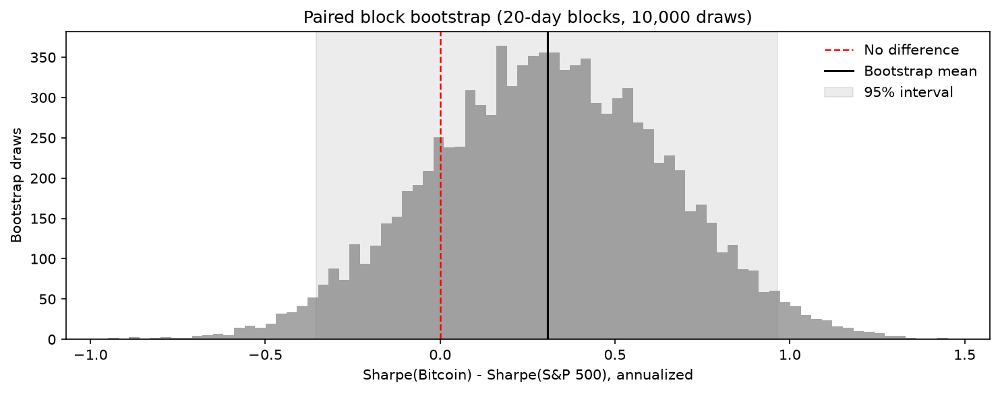
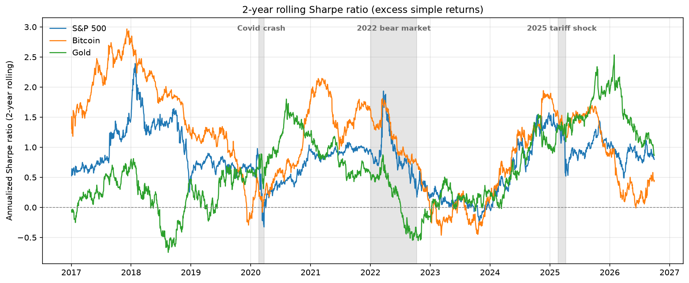
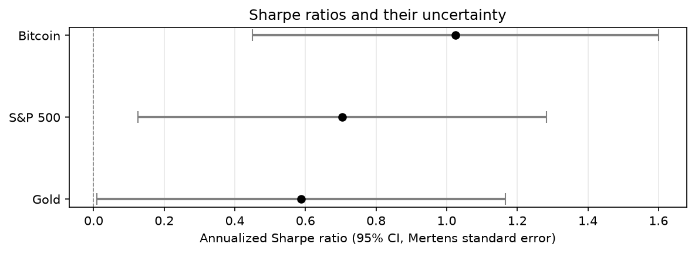
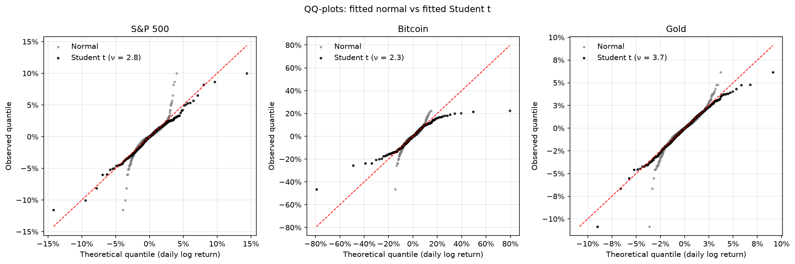
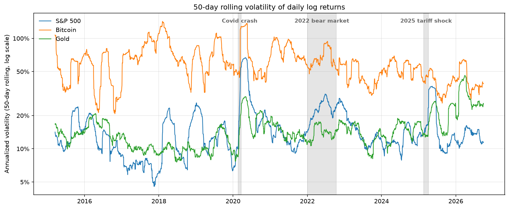
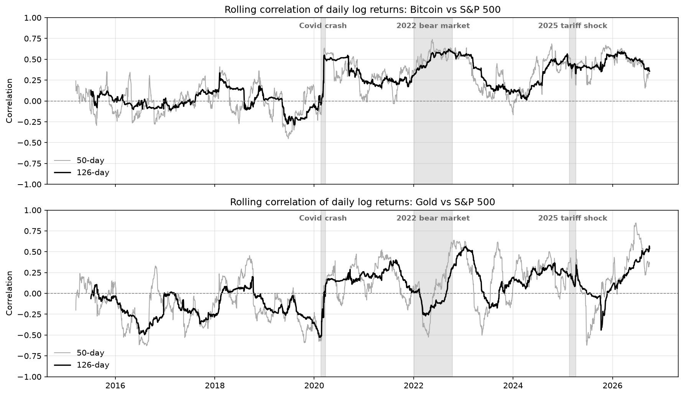

# Bitcoin vs S&P 500: is the Sharpe ratio difference real?

[Français](README.fr.md)

Over 2015–2026, Bitcoin's Sharpe ratio (1.02) is well above the S&P 500's (0.70). This project tests whether that gap is statistically distinguishable from chance once fat tails, correlation and instability over time are taken into account. Gold serves as a third, reference asset.

**Short answer: no.** With 12 years of daily data, the difference cannot be distinguished from noise, and the ranking flips when the sample starts in 2018 instead of 2015.

## Key findings

| | Result |
|:---|:---|
| Sharpe difference, Bitcoin − S&P 500 | 0.32, standard error ≈ 0.34, **p ≈ 0.35**, 95% interval [−0.35, 0.97] |
| Start in January 2018 instead of January 2015 | Bitcoin's Sharpe falls from 1.02 to 0.59: **from first to last**, behind the S&P 500 (0.67) and gold (0.69) |
| Data needed to detect a 0.32 gap | About **57 years** of daily data (correlation 0.24) |
| Fat tails | Student t degrees of freedom of 2.3 to 3.7: theoretical kurtosis is infinite; each asset's worst day sits 10.5–11 standard deviations below its mean |
| Correlation with equities | Regime change in 2020: Bitcoin from 0.02 to 0.39, gold from −0.17 to +0.15 |





## Data

| | |
|:---|:---|
| Assets | SPY (S&P 500 ETF, dividends reinvested), BTC-USD (Bitcoin), GLD (gold ETF) — Yahoo Finance via `yfinance`, adjusted closes |
| Risk-free rate | 3-month Treasury bill, FRED series `DTB3`, converted to a daily rate and lagged by one day |
| Period | 2 January 2015 – 30 September 2026: 2,953 common trading days, 2,952 daily returns |
| Treatment | Days when all three assets trade (US trading days) are kept before computing returns; simple returns for Sharpe and Sortino ratios, log returns for volatility, correlation and distribution analysis |

**Tools:** Python, pandas, NumPy, SciPy, matplotlib, yfinance, fredapi, python-dotenv.

## Methodology

| Step | Content |
|:---|:---|
| 1. Data and returns | Download with explicit checks on failed tickers; simple vs log returns and the σ²/2 volatility drag |
| 2. Volatility | Annualized volatility; 50-day rolling volatility with crisis periods shaded |
| 3. Correlation | Correlation matrix; lead-lag and Dimson (1979) checks for non-synchronous closes; weekly returns; Fisher z-test for a change in 2020; rolling correlations |
| 4. Sharpe and Sortino | Excess simple returns; Sortino & Price (1994) downside deviation; effect of using log returns |
| 5. Normality | Skewness, excess kurtosis, Jarque-Bera and D'Agostino-Pearson tests; days beyond ±3σ with a binomial test; worst day under a normal law |
| 6. Student t | Maximum likelihood fit, AIC comparison, QQ-plots, existence of moments |
| 7. Sharpe confidence intervals | Lo (2002) and Mertens (2002) standard errors |
| 8. Sharpe difference test | Jobson-Korkie test with Memmel's (2003) correction; paired circular block bootstrap (10,000 draws, blocks of 5, 20 and 50 days) |
| 9. Stability | 2015–2019 vs 2020 onwards; start date after the 2017 Bitcoin peak; 2-year rolling Sharpe ratio |

## Other results

| Asset | Volatility | Sharpe | Sortino | Student ν | 95% CI of the Sharpe |
|:---|:---|:---|:---|:---|:---|
| S&P 500 | 17.6% | 0.70 | 0.99 | 2.76 | [0.13, 1.28] |
| Bitcoin | 66.0% | 1.02 | 1.54 | 2.30 | [0.45, 1.60] |
| Gold | 16.3% | 0.59 | 0.83 | 3.73 | [0.01, 1.17] |









## Limitations

- The binomial test, the Fisher test, the Mertens and Memmel standard errors and √252 annualization assume i.i.d. returns; volatility clustering makes them somewhat optimistic. The block bootstrap addresses this partly.
- The percentile block bootstrap is a simplified version of the studentized bootstrap of Ledoit & Wolf (2008).
- Bitcoin's Monday return covers three calendar days; no significant lead-lag effect from different closing times was found.
- ETF fees (SPY about 0.09% per year, GLD about 0.40%) are already deducted from prices.
- `DTB3` is quoted on a discount basis; converting it to an investment yield changes the rate by about 0.04 percentage points per year on average, and the Sharpe ratios by less than 0.003.
- The Student t is fitted with constant volatility; time-varying volatility (GARCH) is not modelled.
- A single data source and a single 12-year window: the results depend on the period, as step 9 shows.

## How to run

```bash
git clone https://github.com/mattondidier/financial-data-lab.git
cd financial-data-lab
python -m venv venv
venv\Scripts\activate            # Windows  |  source venv/bin/activate on macOS/Linux
pip install -r requirements.txt
copy .env.example .env           # Windows  |  cp .env.example .env on macOS/Linux
```

Add a free FRED API key to `.env` (`FRED_API_KEY=...`), then open `05-asset-risk-beyond-volatility/asset_risk.ipynb` and run all cells. Charts are saved to `assets/`.

## References

- Dimson, E. (1979). Risk measurement when shares are subject to infrequent trading. *Journal of Financial Economics*, 7(2), 197–226.
- Jobson, J. D. & Korkie, B. M. (1981). Performance hypothesis testing with the Sharpe and Treynor measures. *Journal of Finance*, 36(4), 889–908.
- Ledoit, O. & Wolf, M. (2008). Robust performance hypothesis testing with the Sharpe ratio. *Journal of Empirical Finance*, 15(5), 850–859.
- Lo, A. W. (2002). The statistics of Sharpe ratios. *Financial Analysts Journal*, 58(4), 36–52.
- Memmel, C. (2003). Performance hypothesis testing with the Sharpe ratio. *Finance Letters*, 1, 21–23.
- Mertens, E. (2002). Comments on variance of the IID estimator in Lo (2002). Working paper, University of Basel.
- Sortino, F. A. & Price, L. N. (1994). Performance measurement in a downside risk framework. *Journal of Investing*, 3(3), 59–64.

The full list is in the notebook.

---

**Didier Matton** | Financial Engineer | Full-Stack Data Scientist | Python, Django, VBA, BI & LLMs | Quantitative Finance
